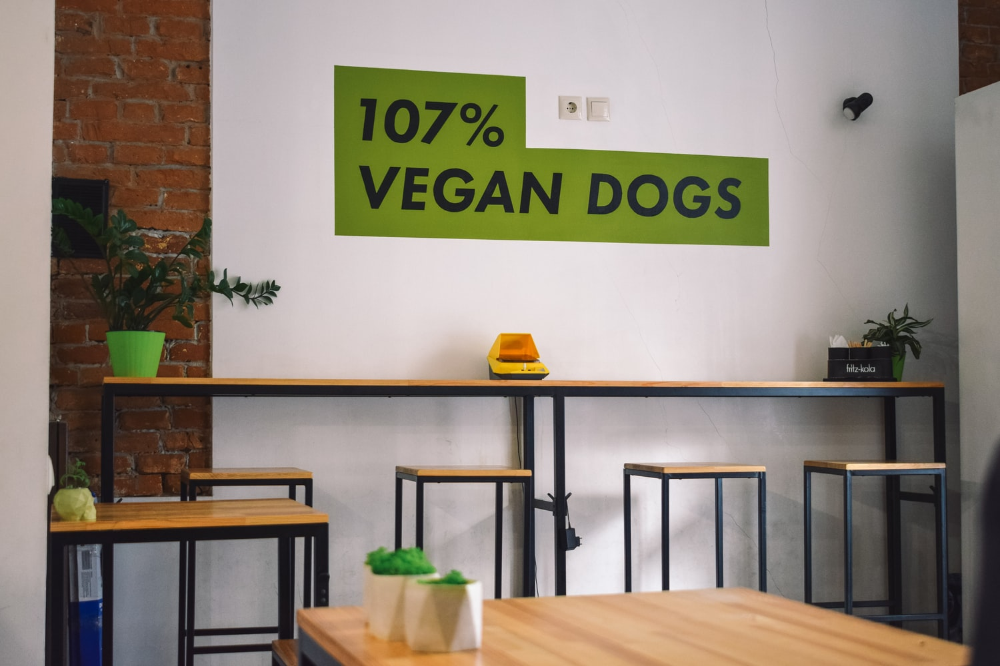
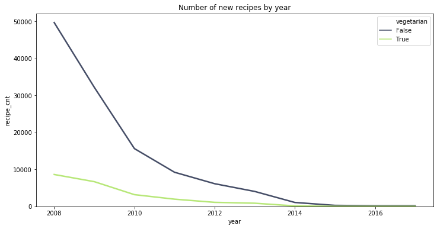
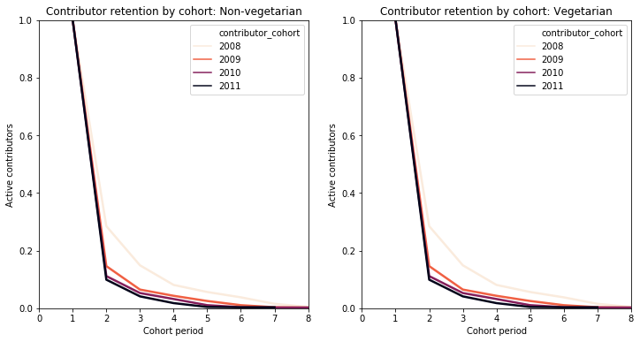
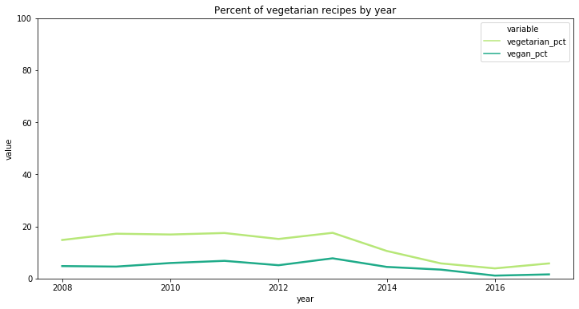
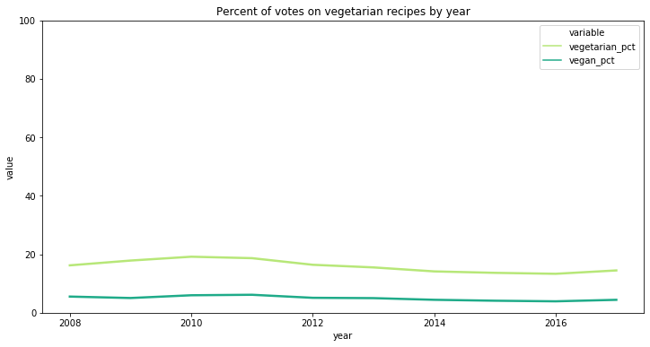
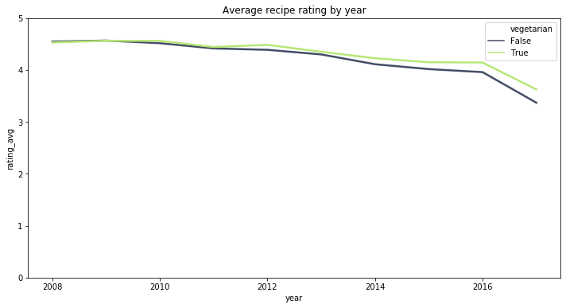
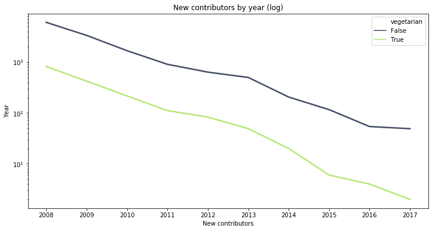

_This is a Udacity Data Science Nanodegree project._

# Vegetarianism is booming. Will established recipe sites benefit or suffer from this trend?
The interest in vegetarian and vegan food has grown steadily over the past two decades.

The number of searches for 'veganism' in the UK has [increased by 900% from 2009 to 2019](https://www.bbc.com/news/business-44488051). And although in 2015, just 3.4% of all Americans said they were vegetarian, fully [a quarter of 25- to 34-year-olds identified as such](https://worldin2019.economist.com/theyearofthevegan).

Below, I will explore whether this vegetarian trend extends to users of [food.com](https://www.food.com/), one of the leading online recipe websites.

_Photo by [Darya Tryfanava](https://unsplash.com/photos/K457r2qDHfk)_

## Unpredecented data
Bodhisattwa Prasad Majumder, Shuyang Li, Jianmo Ni, and Julian McAuley of University of California, San Diego crawled 180K+ recipes and 700K+ reviews from food.com, covering 18 years of user interactions on one of the leading online recipe repositories.

They gathered this data to train a recipe generation algorithm, a fascinating project no doubt. But beyond its value for Machine Learning training, this dataset offers us a unique glimpse into an industry that attracts [86 million monthly visitors in the US alone](https://www.nielsen.com/us/en/insights/article/2014/recipe-for-success-86-million-americans-visited-food-and-cooking-websites/), yet rarely makes the headlines.

## food.com in decline?

The first thing we can immediately see from the data is that there has been a rapid decline in the number of new recipes posted on food.com over the past decade.

Assuming that the data set isn't missing information for some of the more recent years, this decline is somewhat perplexing, as food.com is the second largest recipe website, and internet usage overall has [increased by 10 percentage points](https://www.pewresearch.org/fact-tank/2018/09/28/internet-social-media-use-and-device-ownership-in-u-s-have-plateaued-after-years-of-growth/) in the last decade.

Nevertheless, there could be a number of explanations:
* A saturation of recipes on the website. Everything there is to cook is already covered.
* Related to the preciding point, food.com might have stopped investing in attracting new contributors.
* Users have shifted their recipe consumption to mobile apps by other providers (food.com does not offer one).
* Most prolific recipe authors launched their own recipe blogs, or moved to social media.

We unfortunately don't have the data or space to answer this question in this blog post, but a quick cohort analysis may give us some additional indication into the health of the food.com busines.

Above, we can see that contributor retention at food.com has deteriorated significantly over the years, indicating that new contributors may be less loyal to the food.com brand than they used to be, or less satisfied with their (mobile?) offering.

Whatever the reason for the decline, let's see whether it has had an equal impact on vegetarian and non-vegetarian recipes.

## Vegetarians on food.com are losing ground

The vegetarian category has declined at the same rate as the non-vegetarian portion of food.com, and did even worse between 2014–2017.

Throughout the same 10-year period, the share of ratings posted on vegetarian and vegan recipes has remained flat.

This time, we don't even see a decline in the period between 2014 and 2017, which may suggest that although the number of vegetarian contributors has declined at a faster rate than that of non-vegetarian authors, the reader composition remained roughly the same.

Interestingly, the average rating for vegetarian recipes was roughly the same until 2013, but has since grown to ~0.2 points above that of non-vegetarian recipes. Quality over quantity perhaps?

## Contributor acquision
The alternative explanation for the drop in the share of new vegetarian recipes is that food.com acquires non-vegetarian contributors at a faster rate than vegetarian authors.

Indeed, we can see that from 2014 to 2017, the number of vegetarian contributors has dropped at a faster rate than that of non-vegetarian contributors.

## Conclusion
From our quick look at the food.com data, we can see that the growing vegetarian trend has had no positive impact on food.com, and might have even had a negative impact on their contributor acqusition.

Whatever the case, if the data is correct, the company has much bigger things to worry about, from free-falling usage, to steadily deteriorating contributor retention rates.
