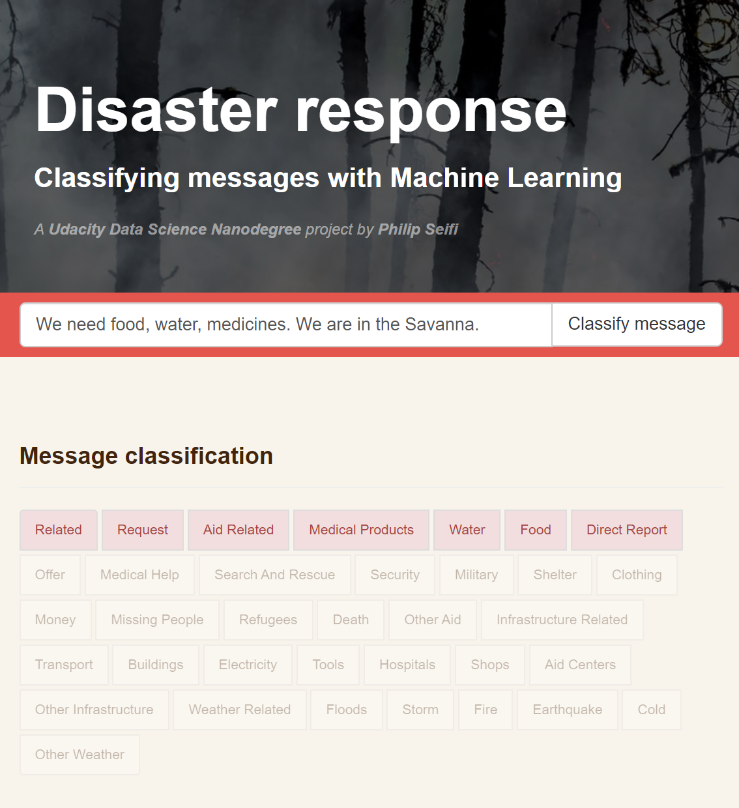

_Udacity Data Science Nanodegree project by [Philip Seifi](https://www.seifi.co/)._

# Disaster response pipeline

Following a disaster, response organizations receive millions of distress messages, both directly, and through news and social media.

Machine Learning can be invaluable to efficiently process these signals, forward messages to relevant partners, and help those who are most in need.

## Dataset

The dataset used for training the classification algorithm was provided by [Appen](https://appen.com/datasets/combined-disaster-response-data/) (formerly Figure Eight).

The data contains 30,000 messages drawn from events including an earthquake in Haiti in 2010, an earthquake in Chile in 2010, floods in Pakistan in 2010, super-storm Sandy in the U.S.A. in 2012, and news articles spanning a large number of years and 100s of different disasters.

It has been encoded with 36 different categories related to disaster response and stripped of messages with sensitive information. One category, `child_alone`, was dropped in the course of this project, as none of the messages were tagged with this label.

## Instructions:
### Run the ETL pipeline (cleans data and stores it in a SQLite database)
`python data/process_data.py data/disaster_messages.csv data/disaster_categories.csv data/DisasterResponse.db`

### Run the ML pipeline (trains and saves a classifier model)
`python models/train_classifier.py data/DisasterResponse.db models/classifier.pkl`

### Run the web app
`cd app`
`python run.py`

Access at http://127.0.0.1:3001/

## Acknowledgements
Data set by [Appen](https://appen.com/datasets/combined-disaster-response-data/).
Header photo by [Joanne Francis](https://unsplash.com/photos/S9NQnIV4zOI)