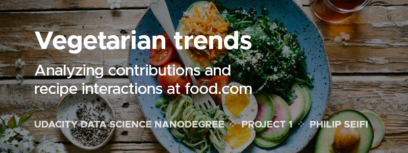
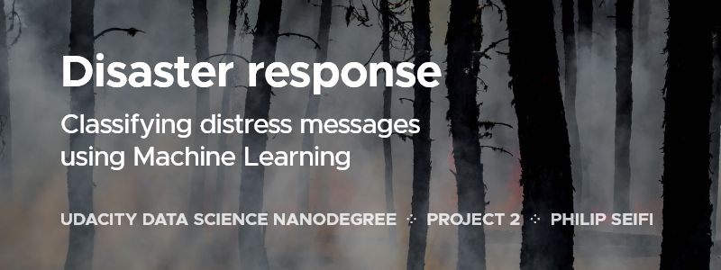
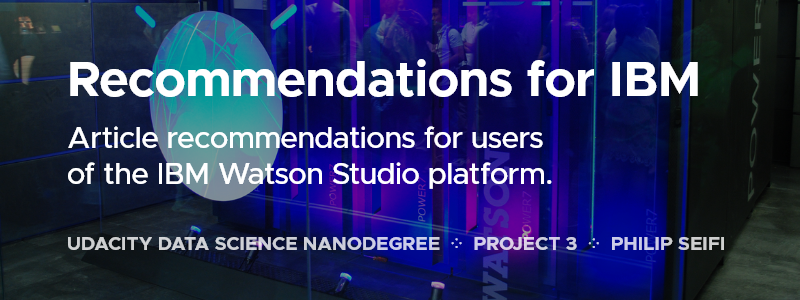
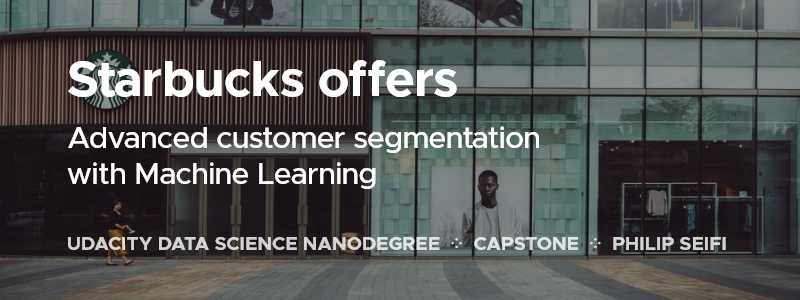

# Data Science Nanodegree Portfolio

This repository contains my work for the Udacity Data Science Nanodegree program, May 2020 cohort.

## Projects:

### *Project 1:* [Food.com Vegetarian Trends](P1%20-%20Food.com%20Vegetarian%20Trends)

### *Project 2:* [Disaster Response Pipelines](P2%20-%20Disaster%20Response%20Pipelines)

### *Project 3:* [Disaster Response Pipelines](P3%20-%20Recommendations with IBM)

### *Capstone:* [Disaster Response Pipelines](https://github.com/seifip/starbucks-customer-segmentation)

## Courses taken:
* The Data Science Process
* ETL Pipelines
* NLP Pipelines
* Machine Learning Pipelines
* Experiment Design
* Statistical Considerations in Testing
* A/B Testing
* Recommendation Engines
* Matrix Factorization for Recommendations
* Communication to Stakeholders

## Skills acquired:
* CRISP-DM
* Python Pipelines
* Rank Based Recommendations
* Collaborative Filtering
* Content Based Recommendations
* Matrix Factorization

## Acknowledgements
Project cover photos by [Brooke Lark](https://unsplash.com/photos/jUPOXXRNdcA), [Joanne Francis](https://unsplash.com/photos/S9NQnIV4zOI), [Darke Lv](https://unsplash.com/photos/jVMAyTGAzdg).
